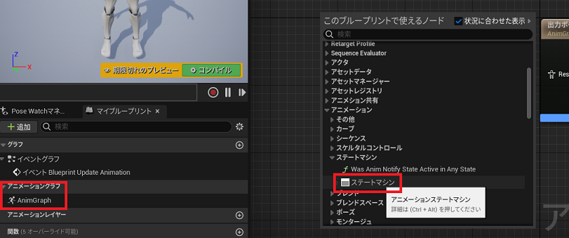
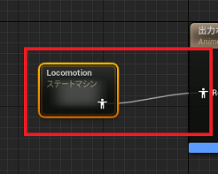
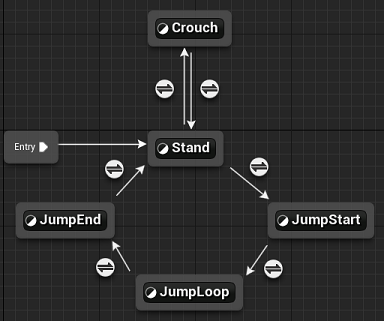
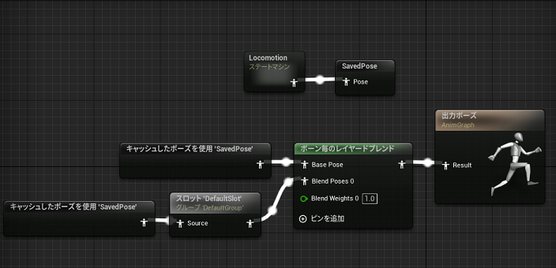
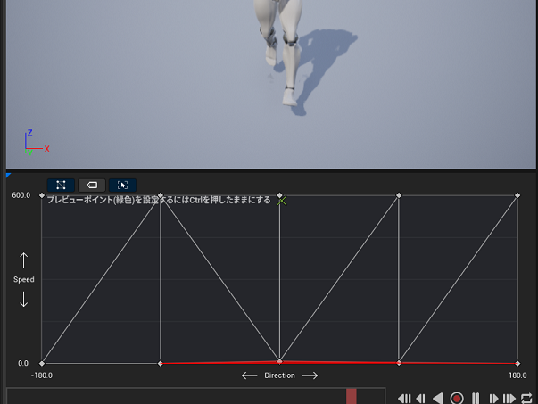

# アニメーション

## アニメーションBP

### AnimInstance
- C++
    - UAnimInstance を継承して作成
    - アニメーションBP 内で条件式を書かなくて済むように C++ に書いておく
- スケルトンを指定、C++ で‘‘作成した AnimInstance 継承クラスを使用して作成する

### ステートマシン
- 「出力ポーズ」からノードをドラッグ - アニメーション - ステートマシンを作成
    
    
    - ここでは Locomotion という名前で作成

    
    - Stand
        - 下記「ブレンドスペース」で作成する BS_Stand を指定し、Speed, Direction 変数を繋ぐ
    - Crouch
        - 下記「ブレンドスペース」で作成する BS_Crouch を指定し、Speed, Direction 変数を繋ぐ
    - JumpStart, JumpLoop, JumpEnd
        - 下記「アニメーションシーケンス」で作成する Jump_From_Stand_Start, Jump_From_Stand_Loop, Jump_From_Stand_End を指定する
    - Sprint
        - Sprint_Fwd_Rifle を指定する
        - 詳細 - Loop Animation にチェック
    - ここでは 条件文は C++ で書いてあるので、ステートを繋ぐだけで良い
- TODO エイリアスを試す

### 上半身ブレンド
- AnimGraph 内
    - 「新規保存のキャッシュされたポーズ」を作成
        - ここでは SavedPoseという名前にした、入力に Locomotion の出力を接続
    - 「ボーン毎のレイヤードブレンド」を作成
        - インスペクタ - コンフィグ - Layer Setup - インデックス[0] - Branch Filters を増やす
        - インデックス[0] - Bone Name に "spine_01" を指定
        - 「キャッシュされたポーズを使用」を作成、「ボーン毎のレイヤードブレンド」の Base Pose へ接続
        - 「スロット 'Default Slot'」を作成
            - 出力を 「ボーン毎のレイヤードブレンド」の Blend Poses0 へ接続
            - 「キャッシュされたポーズを使用」を作成、「スロット 'Default Slot'」の入力へ接続
            - Slot Name を UpperBody へ変更 (UpperBody スロットが無い場合は追加する)
        

## ブレンドスペース
- BS_Stand を作成
    - 軸 (X, Y) = (Direction [-180, 180], Speed [0, 600]) とする
    - 以下のようにアサインする
        |Sp\Dir|-180|90|0|90|180|
        |-|-|-|-|-|-|
        |600|Jog_Bwd_Rifle|Jog_Lt_Rifle|Jog_Fwd_Rifle|Jog_Rt_Rifle|Jog_Bwd_Rifle|
        |0|Idle_Rifle_Hip|Idle_Rifle_Hip|Idle_Rifle_Hip|Idle_Rifle_Hip|Idle_Rifle_Hip|

        

- BS_Crouch を作成
   - 軸 (X, Y) = (Direction [-180, 180], Speed [0, 300]) とする
    - 以下のようにアサインする
        |Sp\Dir|-180|90|0|90|180|
        |-|-|-|-|-|-|
        |300|Crouch_Walk_Bwd_Rifle_Hip|Crouch_Walk_Lt_Rifle_Hip|Crouch_Walk_Fwd_Rifle_Hip|Crouch_Walk_Rt_Rifle_Hip|Crouch_Walk_Bwd_Rifle_Hip|
        |0|Crouch_Idle_Rifle_Hip|Crouch_Idle_Rifle_Hip|Crouch_Idle_Rifle_Hip|Crouch_Idle_Rifle_Hip|Idle_Rifle_Hip|

## アニメーションシーケンス
- ジャンプ時の Start, Loop, End を作成する
    - Jump_From_Stand、Jump_From_Stand_Ironsights, Jump_From_Jog は用意されているが、一連のアニメーションになっているので切り出す
    - アニメーションシーケンスを切り出して、Start、Loop、End を作成
        - Jump_From_Stand ... Start(～17), Loop(18), End(18～)
        - Jump_From_Stand_Ironsights ... Start(～17), Loop(18), End(18～)
        - Jump_From_Jog ... Start(～10), Loop(11), End(11～)

## アニメーションオフセット
- 構え時のエイム9方向を作成する
    - Aim_Space_Hip, Aim_Space_Ironsights は用意されているが、一連のアニメーションになっているので切り出す
    - アニメーションシーケンスを切り出して、LT, CT, RT, LC, CC, RC, LB, CB, RB を作成
        - LT(40), CT(10), RT(71) 
        - LC(35), CC(00), RC(65)
        - LB(50), CB(20), RB(81)
    - パラメータは Yaw, Ptich 

## アニメーションモンタージュ
- TODO

